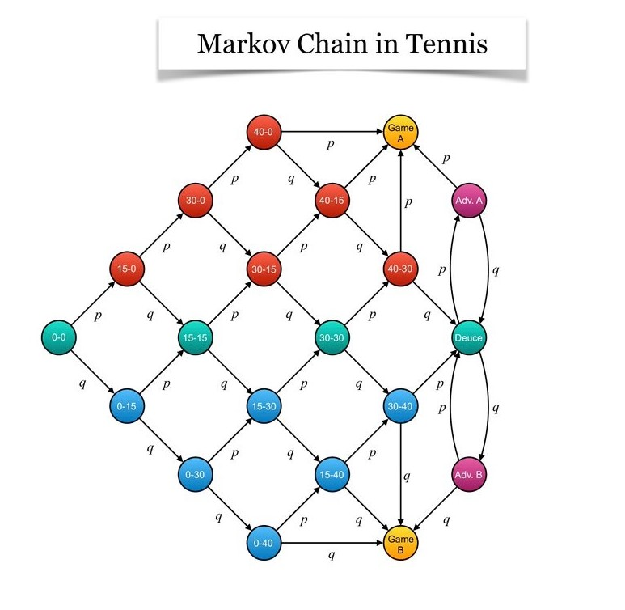
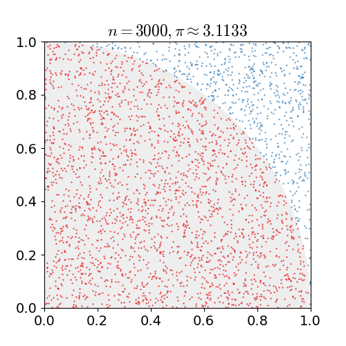
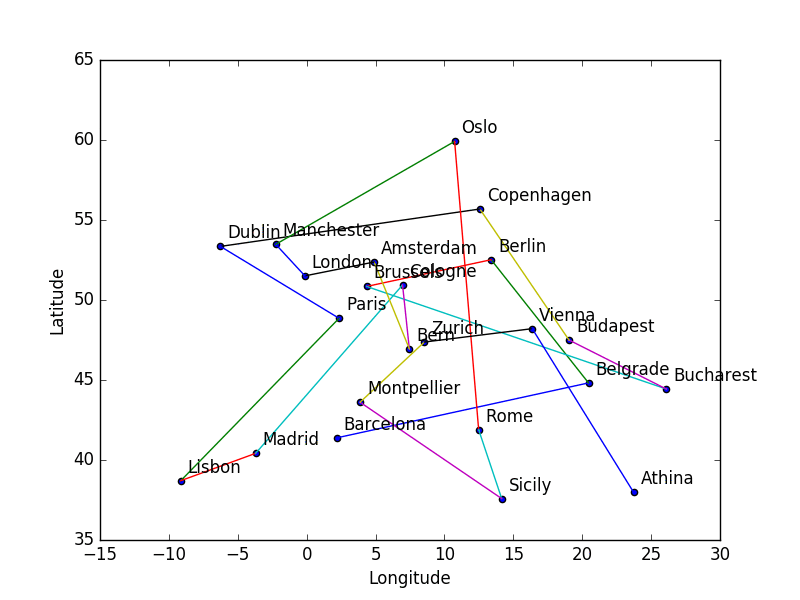

# StochasticProcesses
Some interesting applications of Stochastic Processes using Jupyter Notebooks for descriptive and instructive illustrations can be breifly summarized in the following list:

## Contents
<OL>
  <LI><a href="Notebooks/MarkovChains.ipynb">Markov Chains</a></LI>
  <LI><a href="Notebooks/RandomWalk.ipynb">Random Walks</a></LI>
  <LI><a href="Notebooks/MarkovChainMonteCarloSampling.ipynb">Markov Chain Monte Carlo (MCMC) Sampling</a></LI>
  <LI><a href="Notebooks/MonteCarloApproximations.ipynb">Monte Carlo Approximations</a></LI>
  <LI><a href="Notebooks/ErgodicTheorem.ipynb">Ergodic Theorem</a></LI>
  <LI><a href="Notebooks/IsingModel.ipynb">Ising Model</a></LI>
  <LI><a href="Notebooks/TravellingSalesmanProblem.ipynb">Travelling Salesman Problem</a></LI>
</OL>

## Highlights

### Markov Chains
Modelling a <B>tennis match</B> using <B>Markov Chains</B>.

### Monte Carlo Approximations
Approximating the value of 𝛑 using <B>Monte Carlo Estimates</B>. 

### Ising Model 
<B>Monte Carlo simulation</B> of the <B>two dimensional Ising Model</B>. 

### Travelling Salesman Problem
Solving the <B>[Travelling Salesman Problem](https://en.wikipedia.org/wiki/Travelling_salesman_problem)</B> usng the <B>[Simulated Annealing Algorithm](https://en.wikipedia.org/wiki/Simulated_annealing)</B>.

## References
[1] https://repository.kallipos.gr/handle/11419/6003
  
[2] http://math.ntua.gr/~loulakis/info/python_codes_files
